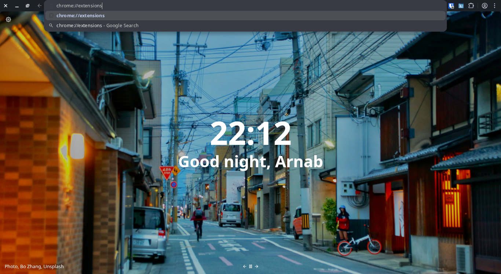
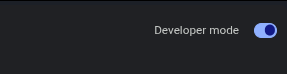
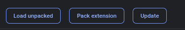

# Carebridge Extension

Browser extension used by Carebridge frontend to enforce interview tab lockdown.

## Setup

### Install Bun

If you don't have Bun installed, follow the official guide:
https://bun.sh

### Install Dependencies

```bash
bun install
```

### Build

```bash
bun run build
```

The built extension will be in the `dist` folder.

## Load Extension in Chrome

1. Open Chrome and navigate to `chrome://extensions`

   

2. Enable **Developer mode** (toggle in the top-right corner)

   

3. Click **Load unpacked**

   

4. Select the `dist` folder from this project

## What it does

- Verifies extension presence from the interview web app.
- Starts global lockdown when interview begins.
- Closes all other browser tabs across all windows.
- Closes any newly opened tab while lockdown is active.
- Sends heartbeats to frontend; if extension is removed/unreachable, frontend terminates interview.
